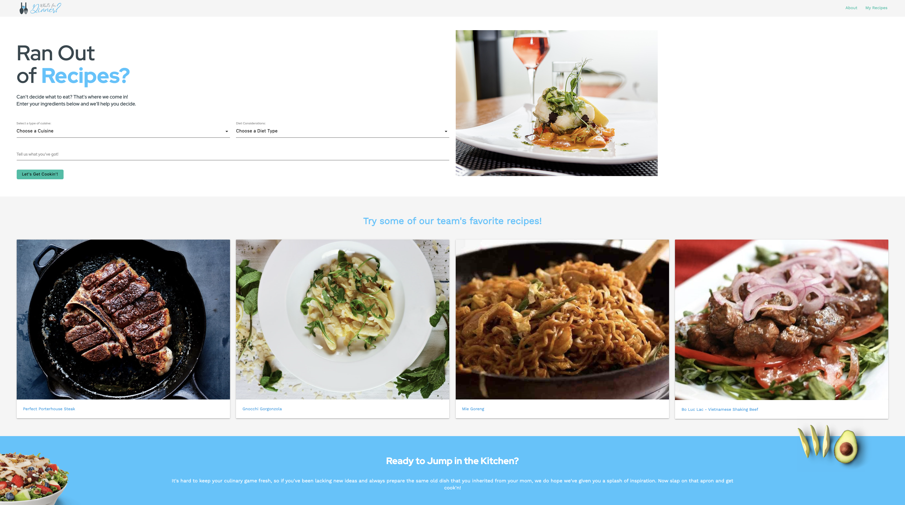
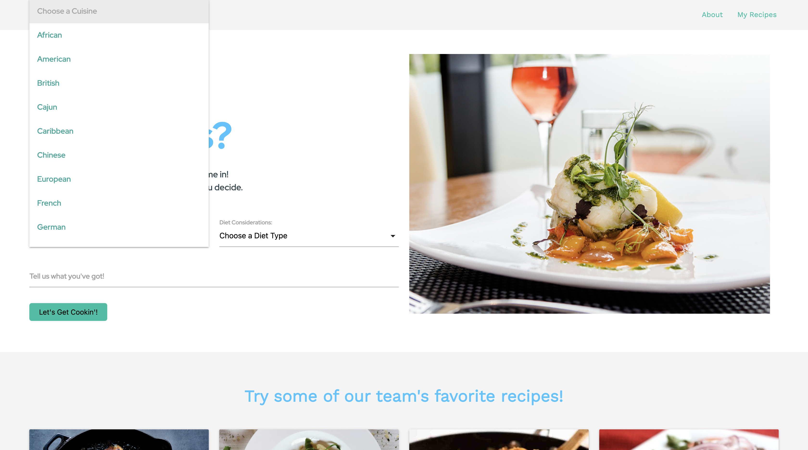
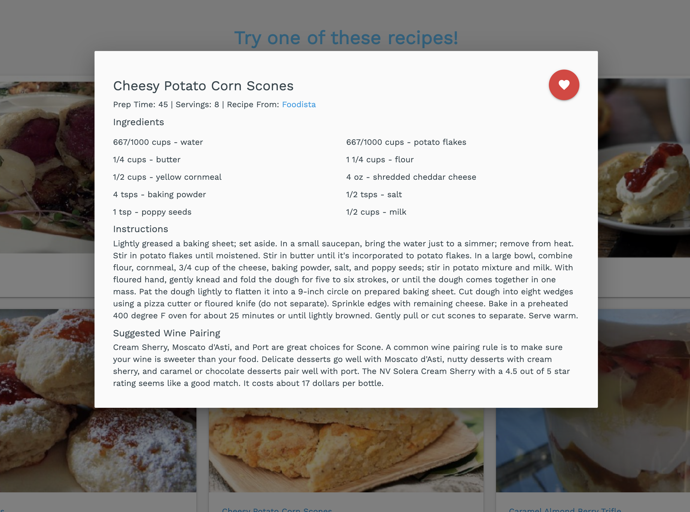
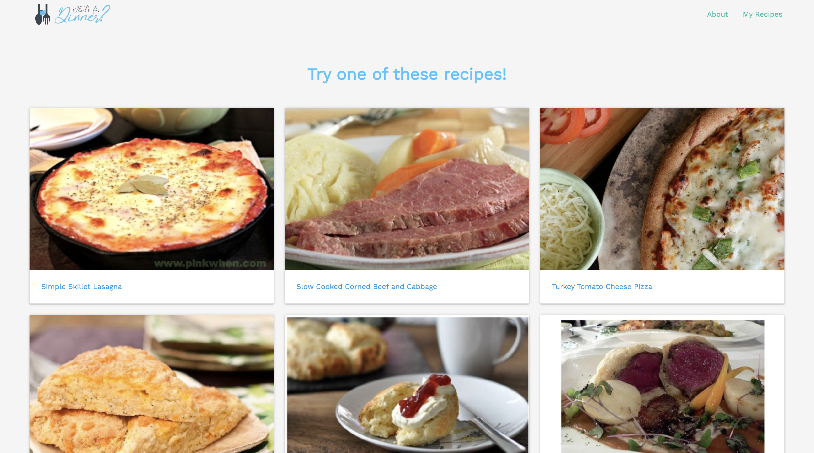

# Project-One - What's for Dinner
UCF Boot Camp: Week 7/8 Group 2 Project 1
 

 

 
 

## Purpose
> Are you stumped with the never-ending question of “What’s for dinner?” from your significant other or kids? We’ve all been there. Long commutes, even longer work days, shuttling your kids to and from school and extracurricular activities. The daily hustle and bustle of life. 

> That’s where we come in! Let us save you the hassle of trying to figure it out. Head on over to our site and use the search bar to enter ingredients you already have on hand and we’ll give you a selection of recipes to choose from. Dietary restrictions? Picky eaters? We’ve got you covered there too!

> So leave your worries and stress behind and let us help you pick “What’s for Dinner?”
 
 

## Contents
1. [Requirements/Description](#requirements/description)
2. [Installation](#installation)
3. [Contribution](#contribution)
4. [Built With/Technologies](#built-with/technologies)
5. [API's](#apis)
6. [Issues](#issues)
 
 

## Requirements/Description
 

### User Story
* AS A busy professional I WANT to use ingredients that I already have on hand.
* SO THAT I can make a simple dinner and pair a wine selection.
 

### Motivation for Development
* Given the daily busy schedules, we wanted to provide people with an easy way to come up with the answer for the never-ending question of “What’s for Dinner?”
 

### Description

* Users first see a search form and a selection of our team's favorite recipes.
* Users can search for dinner inspiration by entering any of the following into the form: type of cuisine, preferred diet, and/or ingredients.
* Our team's favorite recipes are replaced by the search results.
* Displayed cards feature the recipe's name and, when clicked, open a modal with the full recipe.
* Users can save their favorite recipes and view them later under the "My Recipes" page.
* The "About" page includes short biographies about our team.
 
 

## Installation
* An application that will run in the browser and feature dynamically updated HTML and CSS powered by JavaScript & JQuery. Application features polished UI and is responsive, ensuring adaptation to multiple screen sizes.

 
 

### Link to What's for Dinner site
[What's for Dinner](https://deckiedevs.github.io/whats-for-dinner/)
 
 

### Screenshot

 
 

## Contribution

* [Mila Decker](https://github.com/deckiedevs)
* [Jenny King](https://github.com/jennyking0805)
* [Ruben Matamoros](https://github.com/valiantcreative33)
* [Jorge Navarro](https://github.com/jorgeebn16)
 
 

## Built With/Technologies
* [HTML5](https://developer.mozilla.org/en-US/docs/Web/Guide/HTML/HTML5)
* [CSS](https://developer.mozilla.org/en-US/docs/Web/CSS)
* [Javascript](https://developer.mozilla.org/en-US/docs/Web/JavaScript)
* [jQuery](https://jquery.com/)
* [Font Awesome](https://fontawesome.com/)
* [Google Fonts](https://fonts.google.com/)
* [Materialize](https://materialize.com/)
* [Math.js](https://mathjs.org/)
 
 

## API's
* [Spoonacular Search Recipes API](https://spoonacular.com/food-api)
 
 

## Issues

